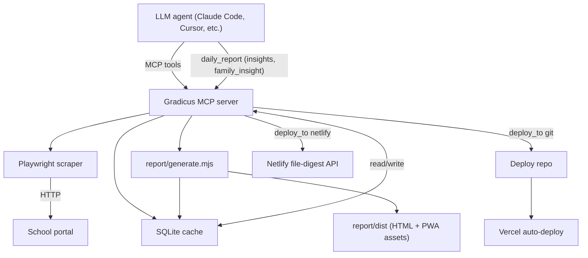

# Gradicus MCP

A Model Context Protocol (MCP) server that gives any LLM agent secure, queryable access to a family's grade portal data, plus a self-contained daily report generator that produces a polished Progressive Web App for parents.

The server logs into a Gradicus-style school portal, scrapes per-student grades, assignments, homework, attendance, demerits, and teacher messages into a local SQLite cache, and exposes them through a stable MCP tool surface. A companion `daily_report` tool composes the cached data — together with LLM-authored insights provided by the calling agent — into a single-file HTML report and pushes it to a static host.

## Features

- **Full-coverage portal scraper** built on Playwright. Authenticates once, then walks each student's report, homework, attendance, demerit, and message pages.
- **Offline-first SQLite cache.** Every tool transparently falls back to cached data when the portal is unreachable. Past school years can be marked frozen so historical grades are preserved even after the source has rotated.
- **15+ MCP tools** covering login, list, grades, homework, schedule, attendance, demerits, emails, manual sync, cache status, debug helpers, and the daily report.
- **AI-authored daily report.** The calling LLM passes per-student paragraphs and a household-level paragraph; the generator drops them into a typed, mobile-first HTML report with charts, color-coded priorities, teacher quote blocks, and a status banner.
- **ChatGPT-style streaming UI.** Insights stream in chunk-by-chunk on page load with a blinking caret, naturally irregular pacing, and proper punctuation pauses. Click to skip, fully respects `prefers-reduced-motion`.
- **Material 3 / 2026-modern interface.** Sticky condensed app bar, hamburger drawer with active-student chip, ripple state layers, summary FAB, light/dark/auto theming with a manual toggle, and explicit responsive breakpoints from 480px to 1280px+.
- **Installable PWA.** Web App Manifest, service worker (network-first for HTML, cache-first for shell), Apple touch icon, maskable Android adaptive icons, in-app install prompt for Chrome/Edge, native instructions for iOS Safari, and an offline banner that shows the cached report's date.
- **Pluggable deploy.** Generates a static `dist/` and pushes it via Git (default — any provider that auto-deploys from a repo) or directly via the Netlify file-digest API.

## Architecture



## Requirements

- Node.js 20.10+ (Node 22 recommended; the local SQLite native module is ABI-versioned to whatever Node runs the MCP)
- A modern browser engine for the scraper (installed automatically via Playwright)
- A school-portal account
- Optional: a static-host account (Vercel, Netlify, or any provider that watches a Git repo)

## Installation

This project uses [Yarn 4](https://yarnpkg.com/) (pinned via `packageManager` in `package.json` and Corepack). If you have a recent Node, run `corepack enable` once to activate the pinned Yarn version.

```bash
git clone <this-repo>
cd <this-repo>
corepack enable              # one-off: activates the pinned Yarn 4
yarn install
yarn playwright install chromium
yarn build
yarn build:icons             # one-off: regenerates PWA icons from report/static/icons/source.png
```

## Configuration

The server reads credentials and deploy options from environment variables. None are hard-coded. When run as an MCP server, the host (e.g. Cursor, Claude Code) sets these in its MCP config block. For local CLI runs, an `.env` file in the project root is loaded automatically (see `.env.example`).

| Variable | Required | Purpose |
| --- | --- | --- |
| `GRADICUS_EMAIL` | yes | Portal account email |
| `GRADICUS_PASSWORD` | yes | Portal account password |
| `MCP_AUTH_TOKEN` | yes (HTTP) | Shared bearer token. Generate with `openssl rand -base64 48`. Server refuses to start if missing or shorter than 32 chars |
| `MCP_ALLOWED_ORIGINS` | optional | Comma-separated list of `Origin` headers to allow. Leave unset to accept any (most MCP clients omit `Origin`) |
| `HOST` | optional | Bind address. Defaults to `127.0.0.1`. Docker sets it to `0.0.0.0` so the compose bridge can reach the app |
| `PORT` | optional | Listen port. Default `3000` |
| `DATA_DIR` | optional | Where the SQLite cache lives. Default `<repo>/data`. Docker sets it to `/data` |
| `CADDY_DOMAIN` | yes (prod) | Public hostname Caddy serves and obtains a Let's Encrypt cert for |
| `GRADICUS_DEBUG_TOOLS` | optional | Set to `1` to expose `debug_page` / `debug_email_page`. Off by default — they dump raw scraped HTML containing PII |
| `NETLIFY_AUTH_TOKEN` | optional | Personal access token; only needed when `daily_report` uses `deploy_to: "netlify"` |
| `NETLIFY_SITE_ID` | optional | Override the default Netlify site ID |
| `GRADICUS_DEPLOY_REMOTE` | optional | Git remote (SSH or HTTPS) for the deploy repo. Defaults to a hard-coded value in `src/index.ts` — change it to your repo before first use. **Note:** the `git` deploy path needs an SSH key with write access mounted into the container, so on Docker/EC2 the supported remote path is `deploy_to: "netlify"` |

Secrets must never be committed. `.env` and `.cursor/mcp.json` are git-ignored by default.

## Running the server

Two modes are supported: local HTTP for dev, and a containerised public-internet deployment for use from any AI agent.

### Local Docker

```bash
cp .env.example .env
# fill in MCP_AUTH_TOKEN (openssl rand -base64 48), GRADICUS_EMAIL, GRADICUS_PASSWORD

docker compose up --build           # uses docker-compose.override.yml, app on localhost:3000
curl http://localhost:3000/healthz  # 200 OK
```

The override file publishes the app on `127.0.0.1:3000` and disables Caddy. To run the production stack locally (with Caddy + TLS) bypass the override:

```bash
docker compose -f docker-compose.yml up --build
```

### Public deployment (EC2 + Caddy + Let's Encrypt)

See [`deploy/ec2/README.md`](deploy/ec2/README.md) for the step-by-step runbook. Summary:

1. Push secrets to AWS SSM Parameter Store (`MCP_AUTH_TOKEN`, `GRADICUS_EMAIL`, `GRADICUS_PASSWORD`, `CADDY_DOMAIN`).
2. Launch a `t3.small` Amazon Linux 2023 instance with the SSM read role attached and `deploy/ec2/cloud-init.yaml` as the user-data.
3. Add an `A` record pointing your `CADDY_DOMAIN` at the instance's Elastic IP.
4. Caddy auto-provisions a Let's Encrypt cert on first request.

## Connecting from an AI agent

### Remote (HTTP) — recommended

Add this to your MCP client's config (works with Cursor, Claude Desktop, ChatGPT MCP, and any other client that supports remote MCP servers with custom headers):

```jsonc
{
  "mcpServers": {
    "gradicus": {
      "url": "https://gradicus-mcp.example.com/mcp",
      "headers": {
        "Authorization": "Bearer <YOUR_MCP_AUTH_TOKEN>"
      }
    }
  }
}
```

For local Docker dev, swap the URL to `http://localhost:3000/mcp`.

### Local stdio (legacy)

The previous stdio entry-point has been removed; the server now only speaks Streamable HTTP. To run it as a local-only MCP server, point your client at the local Docker URL above. There is no longer a `command + args` form.

### Rotating the bearer token

```bash
# 1. New token
NEW="$(openssl rand -base64 48)"

# 2. Update SSM (production) or .env (local)
aws ssm put-parameter --overwrite --type SecureString \
  --name /gradicus/MCP_AUTH_TOKEN --value "$NEW"

# 3. Re-run the bootstrap script (re-pulls SSM into .env) and restart the app
ssh ec2-user@gradicus-mcp.example.com \
  'sudo /usr/local/bin/gradicus-bootstrap.sh && sudo docker compose -f /opt/gradicus/docker-compose.yml up -d'

# 4. Update the Authorization header in every AI agent client.
```

## Security model (MVP)

- HTTPS-only (Caddy + Let's Encrypt, auto-renewing) in production.
- Single shared bearer token, constant-time compared (`timingSafeEqual`), fail-closed: server refuses to start if `MCP_AUTH_TOKEN` is missing or shorter than 32 chars.
- App container has no published ports; only Caddy is reachable from the public internet.
- `Origin` header validation is available via `MCP_ALLOWED_ORIGINS` for defense-in-depth against DNS rebinding.
- Secrets out of the image, in SSM Parameter Store (or a `chmod 600` `.env` file on the host).
- Non-root container user (`pwuser` from the Playwright base image).
- Debug tools (`debug_page`, `debug_email_page`) are off by default; enable with `GRADICUS_DEBUG_TOOLS=1` in trusted local environments only.

Explicit non-goals for the MVP (call out as follow-ups):

- OAuth 2.1 / per-user identity
- Per-tool authorization
- Rate limiting and abuse protection (single-user, low-traffic — add later via Caddy `rate_limit` if needed)
- Audit logging beyond Caddy's access log
- WAF / CloudFront in front of the instance

## MCP Tool Surface

| Tool | Purpose |
| --- | --- |
| `login` | Authenticate with the portal and auto-sync every student into the cache |
| `logout` | Close the browser session (cached data remains queryable) |
| `list_students` | List all students known to the portal/cache |
| `get_grades` | Full grade report for one student |
| `get_grade_summary` | High-level "doing well / needs attention" summary |
| `get_homework` | Tonight's homework, recent assignments, and missing work |
| `get_schedule` | Class schedule with periods, teachers, rooms, rotation |
| `get_attendance` | Detailed attendance: absences, tardies, early dismissals |
| `get_demerit_history` | Demerit log with infractions, dates, and per-GP totals |
| `get_emails` | Recent portal email messages |
| `sync` | Manual full sync (optionally for a past frozen year) |
| `cache_status` | Per-student cache freshness and total record counts |
| `daily_report` | Generate the HTML report and (optionally) deploy it |
| `debug_page`, `debug_email_page` | Return raw HTML for selector-debugging |

### `daily_report` parameters

| Param | Default | Description |
| --- | --- | --- |
| `sync` | `true` if logged in | Re-sync every student before building |
| `deploy` | `true` if any target is configured | Push the built report |
| `deploy_to` | `"git"` | One of `"git"`, `"netlify"`, `"both"`, `"none"` |
| `git_remote` | env or built-in default | Override the deploy repo URL |
| `site_id` | env or built-in default | Override the Netlify site ID |
| `insights` | — | Map of `{ studentName: paragraph }` written by the calling LLM |
| `family_insight` | — | One- or two-paragraph household-level insight |

## Authoring the AI insights

The calling agent is expected to read each student's data via the MCP tools and write the paragraphs fresh on each run. The generator does not produce the prose itself — that responsibility lives with the LLM so the language can adapt to current data.

Recommended voice (matches the bundled slash-command guidance in `.claude/commands/daily-report.md` if present):

- Trusted teacher / family coach speaking to a parent over coffee
- Lead by celebrating something genuinely working
- Name the one thing worth focusing on as a manageable next step
- Suggest one warm, doable parent move for the week
- 4–6 sentences per student; 1–2 short paragraphs for the family insight
- Selective with numbers; soften diagnostic words; no empty platitudes

## The daily report

The generator emits a single self-contained HTML file (~200 KB) with all CSS and JavaScript inline plus the PWA shell beside it.

Per-student panel:

- "Today's Insight" card (LLM-authored, streams in)
- Status banner (Critical / Concern / Watch / Good)
- Today's Priorities (urgent, tonight, this-week, watch)
- Overview stats and grade chart
- Full grades table with color-coded scores and trend arrows
- Teacher quote blocks
- Recent assignments grid
- Homework + missing + upcoming
- Attendance summary + donut chart + event log
- Demerits chart + history
- Email messages

Summary tab:

- Family-level insight at the top
- Per-kid count pills (urgent / tonight / week / watch)
- Status-sorted student cards with quick-jump buttons

## Deployment

Two paths are supported side-by-side. The preferred default is Git → static host because it leaves no API keys in the MCP server and gives you free preview deploys + rollbacks.

### Git → static host (default)

1. Create a new private GitHub repo for the deploy artifact.
2. Set `GRADICUS_DEPLOY_REMOTE` to the SSH or HTTPS URL of that repo.
3. Make sure your local `git config user.email` matches a verified email on your GitHub account (otherwise some hosts will reject the deploy).
4. Connect the repo to your static host (Vercel / Cloudflare Pages / similar) as an "Other / Static" project with no build command and the repo root as the output directory.
5. Run `daily_report (deploy_to: "git")` — the tool clones the repo into a local `.deploy/` directory, mirrors the latest `dist/` into it, writes a `vercel.json` for proper MIME types and PWA caching, commits with a timestamped message, and pushes. Your host auto-deploys.

### Netlify

1. Create a Netlify site and a personal access token.
2. Set `NETLIFY_AUTH_TOKEN` (and optionally `NETLIFY_SITE_ID`) in the MCP env.
3. Run `daily_report (deploy_to: "netlify")`. The tool uses the file-digest API to upload only changed files.

### Local-only

`daily_report (deploy_to: "none")` builds `report/dist/index.html` and stops there. Open the file directly in a browser.

## Installing the report as an app (PWA)

After the first deploy, the live URL is installable on every major platform:

- **iPhone / iPad (Safari):** Share → Add to Home Screen
- **Android (Chrome):** in-app Install button (or Chrome's address-bar install prompt)
- **Desktop (Chrome / Edge):** address-bar install icon, or in-app Install button
- **macOS Safari 17+:** File → Add to Dock

Once installed, the app runs in standalone mode, shows the cached report when offline (with a "showing report from <date>" banner), and refreshes silently the next time it's opened online.

## Project layout

```
src/
  index.ts              MCP server entry; tool definitions; deploy helpers
  scraper.ts            Playwright-based portal scraper
  cache.ts              SQLite schema, read/write, freeze logic
  types.ts              Shared report/grade/attendance interfaces
report/
  generate.mjs          HTML report generator (reads from SQLite cache)
  static/               PWA assets copied verbatim into dist/
    manifest.webmanifest
    sw.js
    icons/              PNG/SVG icon set (regenerate via yarn build:icons)
    _headers            Headers for Netlify-only deploys
  dist/                 Generated output (git-ignored)
scripts/
  build-icons.mjs       Resizes report/static/icons/source.png into all sizes
  run-daily-report.mjs  CLI driver that exercises the daily_report tool
data/                   SQLite cache (git-ignored)
.deploy/                Local clone of the deploy repo (git-ignored)
```

## Available scripts

| Command | Purpose |
| --- | --- |
| `yarn build` | Compile TypeScript to `dist/` |
| `yarn start` | Run the MCP server on stdio |
| `yarn report` | Build the HTML report locally without deploying |
| `yarn deploy` | One-shot driver: login → sync → daily_report (uses `.env`) |
| `yarn build:icons` | Regenerate PWA icons from the source PNG |

## Privacy & Security

This server scrapes and caches sensitive personal information about minors (grades, attendance, behavior records, teacher messages). Treat the cache and any deploy artifacts with the same care.

- Credentials live only in environment variables; never commit them.
- The SQLite cache lives at `data/gradicus.db` (git-ignored).
- The deploy artifact contains real student data; the deploy repo must be **private** even though the deployed site is itself public via the static host.
- Scrubbing previously-deployed content from the static host's CDN cache is the host's responsibility — rotate the deploy if a student needs their record taken down.
- The generator runs entirely locally; the LLM-authored insights are passed in by the calling agent and never leave the host process.

## Tech stack

- [TypeScript](https://www.typescriptlang.org/) on Node.js 20+
- [@modelcontextprotocol/sdk](https://github.com/modelcontextprotocol/typescript-sdk) for the MCP server
- [Playwright](https://playwright.dev/) for portal automation
- [better-sqlite3](https://github.com/WiseLibs/better-sqlite3) for the local cache
- [Chart.js](https://www.chartjs.org/) for the in-report charts (loaded from CDN at view time)
- [sharp](https://sharp.pixelplumbing.com/) for icon generation
- [zod](https://zod.dev/) for tool schema validation

## Status

This project targets a single school portal vendor and was developed as a personal tool. The architecture is intentionally generic enough to fork — the scraper module is the only piece coupled to a specific portal, and the cache, MCP surface, generator, and PWA shell would all transfer cleanly to a different source.

Bug reports and PRs welcome.

## License

See [LICENSE](LICENSE) (add one before publishing if not already present).
